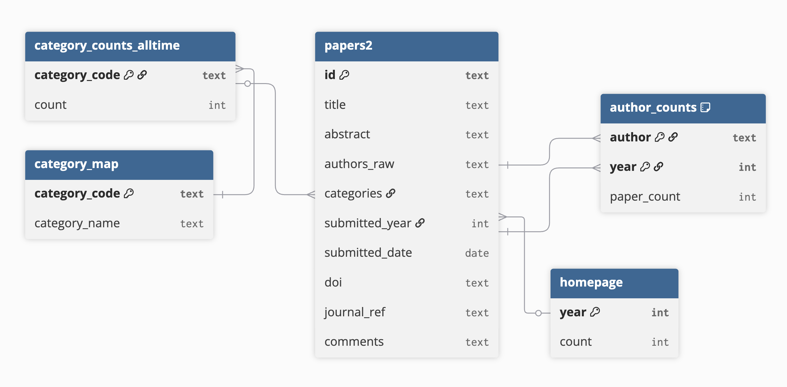

# ArXiv Dashboard
A dashboard for displaying arXiv metadata in accessible ways.

# Database Documentation

This database contains processed and derived metadata tables constructed from arXiv submission records. The schema supports longitudinal, author-level, category-level, and topic-based analysis of arXiv publications.

#### 1. `papers2.csv` — Primary Table

This is the central table containing one row per arXiv submission. All downstream tables are derived from this table.

| Column Name      | Data Type | Key Type        | Description                                                         |
| ---------------- | --------- | --------------- | ------------------------------------------------------------------- |
| `id`             | text      | Primary Key     | Unique arXiv identifier for the paper (e.g., `2512.05118`).         |
| `title`          | text      | —               | Title of the paper as submitted to arXiv.                           |
| `abstract`       | text      | —               | Abstract text describing the paper’s content.                       |
| `authors_raw`    | text      | —               | Raw authorship string provided by arXiv.                            |
| `categories`     | text      | —               | Space-delimited list of arXiv category codes.                       |
| `submitted_year` | int       | —               | Year the first version of the paper was submitted.                  |
| `submitted_date` | date      | —               | Date the first version of the paper was submitted.                  |
| `doi`            | text      | —               | Digital Object Identifier, if available.                            |
| `journal_ref`    | text      | —               | Information about the journal the paper was published in.           |
| `comments`       | text      | —               | Author-provided comments (e.g., page count, figures).               |

#### 2. `abstract_length_by_year.csv`

This table summarizes abstract length trends over time.

| Column Name     | Data Type | Key Type        | Description                                                         |
| --------------- | --------- | --------------- | ------------------------------------------------------------------- |
| `year`          | int   | Primary Key     | Submission year.                                                    |
| `avg_length`    | float     | —               | Average abstract word count for papers in the given year. |
| `median_length` | float     | —               | Median abstract word count for papers in the given year.  |

#### 3. `author_counts.csv`

This table provides a longitudinal author–year panel derived from parsed authorship strings.

| Column Name   | Data Type | Key Type                  | Description                                                      |
| ------------- | --------- | ------------------------- | ---------------------------------------------------------------- |
| `author`      | text      | Primary Key | Normalized author name parsed from `authors_raw`.                |
| `year`        | int   | Primary Key | Submission year.                                                 |
| `paper_count` | int   | —           | Number of papers by the given author in the given year. |

#### 4. `category_counts_alltime.csv`

This table summarizes total paper counts by arXiv category code across all years.

| Column Name     | Data Type | Key Type        | Description                                       |
| --------------- | --------- | --------------- | ------------------------------------------------- |
| `category_code` | text      | Primary Key     | arXiv category code (e.g., `cs.LG`).              |
| `count`         | int       | —               | Total number of papers assigned to this category. |

#### 5. `category_map.csv`

This table maps arXiv category codes to human-readable category names.

| Column Name     | Data Type | Key Type        | Description                                                  |
| --------------- | --------- | --------------- | ------------------------------------------------------------ |
| `category_code` | text      | Primary Key     | Official arXiv category code.                                |
| `category_name` | text      | —               | Descriptive category name (e.g., “Artificial Intelligence”). |

#### 6. `default_table.csv`

This table contains a recent subset of papers for display in the dashboard.

| Column Name  | Data Type | Key Type    | Description                           |
| ------------ | --------- | ----------- | ------------------------------------- |
| `id`         | text      | Primary Key | arXiv paper identifier.               |
| `title`      | text      | —           | Title of the paper.                   |
| `authors`    | text      | —           | Raw authorship string.                |
| `categories` | text      | —           | Space-delimited arXiv category codes. |
| `date`       | date      | —           | Submission date.                      |
| `comments`   | text      | —           | Author-provided comments.             |

#### 7. `multicategory_by_year.csv`

This table quantifies the prevalence of papers assigned to multiple categories over time.

| Column Name | Data Type | Key Type        | Description                                                           |
| ----------- | --------- | --------------- | --------------------------------------------------------------------- |
| `year`      | int       | Primary Key     | Submission year.                                                      |
| `sum`       | int       | —               | Number of papers with more than one category.                  |
| `share`     | float     | —               | Proportion of papers with more than one category.              |

#### 8. `dl.csv`, `ml.csv`, `rl.csv`, `llm.csv`, `homepage.csv`

These tables share an identical schema and capture annual submission counts for specific topics or overall submissions.

| Column Name | Data Type | Key Type        | Description                                                      |
| ----------- | --------- | --------------- | ---------------------------------------------------------------- |
| `year`      | int   | Primary Key         | Submission year.                                                 |
| `count`     | int   | —                   | Number of papers matching the criteria for the given year. |

**Table purposes:**

* `dl`: Deep Learning–related papers
* `ml`: Machine Learning–related papers
* `rl`: Reinforcement Learning–related papers
* `llm`: Large Language Model–related papers
* `homepage`: Total arXiv submissions per year
